= Best Practice: SSL-Zertifikat bestellen
:lang: de
:keywords: SSL, Let's_Encrypt, let's_enrypt, Lets_Encrypt, lets_encrypt, COMODO, comodo
:position: 1

== Wissenswertes über die SSL-Zertifizierung

=== Preis-Modell der SSL-Zertifizierung 

WARNING: Die Bereitstellungsgebühr wird *nicht* für bereits erfolgreich abgeschlossene SSL-Bestellungen von COMODO-Zertifikaten erhoben.

''''

Für das Bereitstellen des SSL-Zertifikates wird eine *mtl. Gebühr in Höhe 2,- € netto zzgl. der Kosten des SSL-Zertifikats* erhoben.

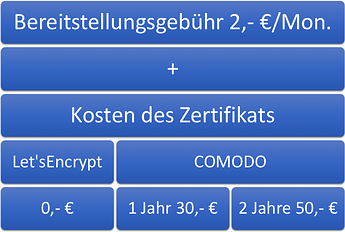

''''

Demnach ergeben sich folgende jährliche Kosten je Modell in aufsteigender Reihenfolge:

[options="header,footer"]
|============================================
|Zertifikat     |Berechnung     | Kosten p.a
|Let's Encrypt  | 12*2 + 12*0   | 24,- € 
|COMODO 2 Jahre | 12*2 + 1*50/2 | 49,- €
|COMODO 1 Jahr  | 12*2 + 1*30   | 54,- €
|============================================

TIP: Alle Preise wurden in *netto* angegeben.

=== Let’sEncrypt oder COMODO - Welches Zertifikat soll ich nutzen?

==== Pro Let’sEncrypt
* günstigstes SSL-Zertifizierungsmodell
* voll automatisierte Verlängerung

==== Contra Let’sEncrypt
* die Vertrauenswürdigkeit wird im Hintergrund von der kleinen link:https://de.wikipedia.org/wiki/Zertifizierungsstelle[Zertifizierungsstelle]  (Certification Authority - kurz: CA) link:https://www.identrust.com[IdenTrust] bescheinigt – es handelt sich um keine traditionelle CA, sondern um ein Zertifikate ausstellendes Bank-Konsortium.

Offizielle Homepage: https://letsencrypt.org/

'''

==== Pro COMODO
* weltweit anerkannte und über Jahre vertrauensvolle link:https://de.wikipedia.org/wiki/Zertifizierungsstelle[CA].
* Im Falle eines Missbrauchs oder Datenverlustes besteht Garantieanspruch bei der ausstellenden CA.

==== Contra COMODO
* keine automatische Verlängerung
* zwingend strikte Einhaltung des Beschriebenen Bestellvorgangs notwendig
* das E-Mail-Postfach *hostmaster*@deineDomain.tld muss angelegt und abrufbar sein

Offizielle Homepage: https://comodosslstore.com/

=== Domainvoraussetzungen
Ein SSL-Zertifikat muss und kann ausschließlich für die *Hauptdomain* des jeweiligen Hauptsystems oder Mandanten geordert werden.
Siehe *Service Center » Systeme » PID » Tab: Domain » DID » Systemverknüpfung*
image:assets/systemverknüpfung_hauptdomain.png[systemverknüpfung_hauptdomain]
Die Bestellung eines SSL-Zertifikats *ist nicht möglich*, wenn für die entsprechende Domain unter dem Menüpunkt Systemverknüpfung die Auswahl externer Server abgespeichert ist.
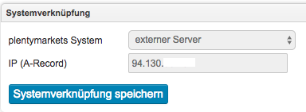

=== Veröffentlichung / Bereitstellung
Nach Bestellung eines neuen Zertifikats muss dieses durch einen regelmäßig ausgeführten *Systemprozess* veröffentlicht werden. *Dies kann bis zu 60 Minuten dauern.*

=== Qualitätskontrolle durch die Zertifizierungsstelle
In Einzelfällen führt die Zertifizierungsstelle eine Qualitätskontrolle durch bevor sie SSL-Zertifikate freischaltet. Prüfe daher die auf dem Bildschirm angezeigte Bestätigungsnachricht. Eine Qualitätskontrolle dauert in der Regel bis zu 24 Stunden. Sollte der Status im Service-Center nach 24 Stunden nicht *done* lauten, melde Dich im Forum unter Angabe der betroffenen Domain.

=== Gültigkeitsdauer

==== Gültigkeitsdauer für Let’sEncrypt-Zertifikate
* SSL-Zertifikate von *Let’sEncrypt* sind jeweils *90 Tage* gültig.
* Alle *60 Tage* wird das Zertifikat *erneuert.*

[options="header,footer"]
|============================================
|Ausstellungsdatum  |gültig bis | Erneuerungsdatum
|01.01.18           | 01.04.18  | 02.03.18
|02.03.18           | 31.05.18  | 01.05.18
|01.05.18           | 30.07.18  | 30.06.18
|30.06.18           | 28.09.18   | 29.08.18
|29.08.18           | 27.11.18	| 28.10.18
|28.10.18           | 26.01.19	| 27.12.18
|27.12.18           | 27.03.19	| 25.02.19
|============================================

===== Let’sEncrypt kündigen
Die Kündigung des Let’sEncrypt-Zertifikats sorgt dafür, dass keine Erneuerung stattfindet.
Die Laufzeit des aktuell ausgestellten Zertifikats wird dadurch nicht beeinflusst.

[options="header,footer"]
|============================================
|Ausstellungsdatum  |gültig bis | Erneuerungsdatum
|01.01.18           | 01.04.18  | 02.03.18
|02.03.18           | 31.05.18  | 01.05.18
|============================================

==== Kündigung am 18.05.2018
Die letzte Erneurung des SSL-Zertifikats fand am 01.05.2018 statt. Demnach ist das SSL-Zertifikat ab dem Datum 90 Tage gültig. Nach Ablauf der 90Tage wird die entsprechende Domain nicht mehr per HTTPS ausgeliefert und wird demnach als _Nicht sicher_ eingestuft.

[options="header,footer"]
|============================================
|Ausstellungsdatum  |gültig bis | Erneuerungsdatum
|01.05.18           | 30.07.18  | entfällt wg. Kündigung
|============================================

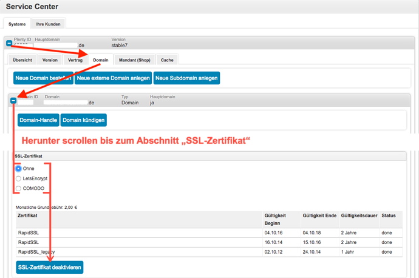ssl-zertifikat_deaktivieren

==== Gültigkeitsdauer für COMODO-Zertifikate
Die Gültigkeitsdauer von neu bestellten Zertifikaten beginnt mit dem Datum der Bestätigung der Zertifizierungsstelle. Eine eventuelle Restlaufzeit des vorherigen Zertifikats kann nicht übernommen werden.

Die Laufzeit des SSL-Zertifikats wird während des Bestellprozesses zur Auswahl gestellt:
* 1 Jahr 
* 2 Jahre

=== Verlängerung des SSL-Zertifikats

==== Verlängerung für Let’sEncrypt-Zertifikate
Die Verlängerung der Let’sEncrypt-SSL-Zertifikate findet vollautomatisch statt, bis es im Service-Center durch das Entfernen des Hakens gekündigt wird.

==== Verlängerung für COMODO-Zertifikate
Ein von COMODO ausgestelltes SSL-Zertifikat verlängert sich *nicht automatisch* → es muss nach Ende der Laufzeit (mindestens 1 Jahr) neu geordert werden.

14 Tage vor offiziellem Ablaufdatum des Zertifikats (siehe Service-Center) wird eine Erinnerungs-E-Mail an die Hostmaster-Adresse gesendet.

Zusätzlich besteht die Möglichkeit, sich per E-Mail erinnern zu lassen. Eine kostenfreie Möglichkeit stellt der Dienst http://letsmonitor.org/ dar.

=== Gekündigte Domains und Testdomains
Für bereits *gekündigte* Domains, sowie für *Startup-* bzw. *Test-Subdomains* (d.h. Domains mit den Bestandteilen _plenty-test-drive.eu, plentymarkets-x1.com, plentymarkets-cloud01/02.com_ etc.,) können *keine SSL-Zertifikate bestellt* werden.

=== Domainvalidierte /-bezogene Zertifikate
SSL-Zertifikate sind domaingebunden. Das bedeutet, dass beispielsweise bei Umstellung der Hauptdomain das aktuelle Zertifikat _inaktiv_ geschaltet wird, da eine neue Hauptdomain ohne bestelltes Zertifikat vorliegt.
Inaktiv bedeutet nicht gelöscht - Sollte die Hauptdomain erneut auf die Domain umgestellt werden, die bereits ein SSL-Zertifikat besaß, kann dieses im Service Center wieder aktiviert werden, sofern das SSL-Zertifikat noch gültig ist.

=== Domainumzug, PKI, SSL-Zertifikat verschieben / transferieren
SSL-Zertifikate können bei einem Domainumzug zu plentymarkets *nicht* mitgenommen werden. Aufgrund der technischen Gegebenheiten ist die Bestellung nur innerhalb unserer link:https://de.wikipedia.org/wiki/Public-Key-Infrastruktur[Public-Key-Infrastruktur] möglich.

Dies gilt für *beide Richtungen*. Sowohl von *extern zu plentymarkets*, als auch von *plentymarkets zu extern*. Ein über plentymarkets gebuchtes SSL-Zertifikat muss *systemnah* liegen und kann bei einem Domaintransfer nicht mitgenommen werden. Ein Export der Zertifikatsdaten (geheimer Private-Key) ist *nicht* möglich. Auch ein “Transfer” eines SSL-Zertifikats von einer Domain(-ID) auf eine andere ist nicht möglich (siehe Punkt <<Veröffentlichung / Bereitstellung>>).

CAUTION: Um die gewünschte Domain mit einem gültigen SSL-Zertifikat auszuliefern, siehe ab <<Schritt für Schritt zum SSL-Zertifikat>> 

=== Wildcard-Zertifikate
Das Ausstellen von sogenannten Wildcard-SSL-Zertifikaten ist in unserer Infrastruktur nicht möglich.

== Schritt für Schritt zum SSL-Zertifikat

=== SSL-Zertifikat von Let’sEncrypt

==== Wie gelange ich zum Bestellvorgang?
Logge Dich über dein Backend oder den folgenden Link in Dein Service-Center ein: https://www.plentymarkets.eu/my-account/

Für den Login benötigst Du die E-Mail-Adresse, die Du auf Deiner Rechnung findest und das dazugehörige Passwort. Wenn Du das Passwort nicht (mehr) kennst, benutze die Funktion zum Zurücksetzen des Passworts.

==== Wie bestelle ich erfolgreich ein SSL-Zertifikat von Let’sEncrypt?

IMPORTANT: *ACHTUNG* +
Es ist zwingend notwendig, dass die DNS-Einstellungen der Domain, für die das SSL-Zertifikat bestellt werden soll, den Angaben in Deinem Service-Center entsprechen - siehe auch link:https://forum.plentymarkets.com/t/selbsthilfe-bei-dns-problemen-wie-hinterlege-ich-korrekte-dns-einstellungen/65559[Selbsthilfe bei DNS-Problemen / Wie hinterlege ich korrekte DNS-Einstellungen].

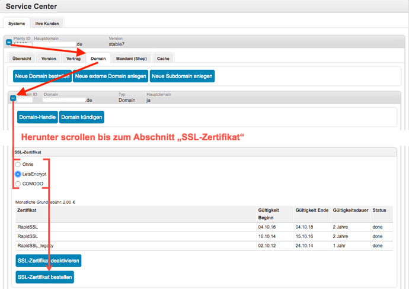

=== SSL-Zertifikat von COMODO

==== Wie gelange ich zum Bestellvorgang?
Vor der Bestellung eines SSL-Zertifikates muss die E-Mail-Adresse *hostmaster*@*deineDomain.tld* angelegt werden, falls dies noch nicht geschehen ist. An diese Adresse werden die beiden im nachfolgenden Schritt beschriebenen E-Mails im Anschluss an die Bestellung versendet.

''''

*WICHTIG:*
Falls eine Weiterleitung für die o.g. Email-Adresse eingerichtet wurde, sollte diese vorübergehend deaktiviert werden, um den Erhalt der Emails gewährleisten zu können. Im Falle eines Kontos bei https://mailbox.org

''''
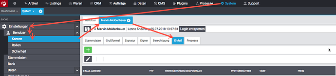

Um E-Mail-Konten im plentymarkets-Backend anlegen zu können, muss zunächst der E-Mail-Provider auf https://mailbox.org gewechselt werden, *oder* die Anlage des Postfachs hostmaster@deineDomain.de bei einem Mailprovider Deiner Wahl getätigt werden.
Wie dieses Postfach eingerichtet wird haben wir hier erklärt: link:https://forum.plentymarkets.com/t/umzug-zu-mailbox-org-leitfaden/25678[Umzug zu mailbox.org - Leitfaden]

Anschließend loggen wir uns *über das plenty-Backend* ins Service-Center ein:
*Start » plentymarkets-Konto » Service-Center*

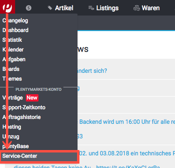

==== Wie bestelle ich erfolgreich ein SSL-Zertifikat von COMODO?

[IMPORTANT:]
====
*WICHTIG UND UNBEDINGT BEACHTEN:*
Während des gesamten Bestellprozesses muss man mit ein und demselben Browser im Service-Center eingeloggt bleiben. Erst *nachdem der Vorgang komplett* abgeschlossen wurde, kann man sich ausloggen!
====

Nun kann der eigentliche Bestellvorgang starten. Man öffnet nun das System und die gewünschte Hauptdomain.
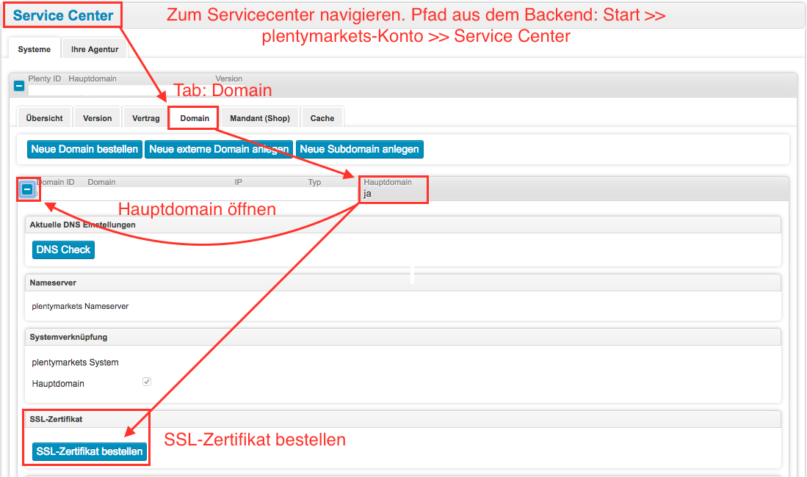

Der folgende Dialog erscheint:
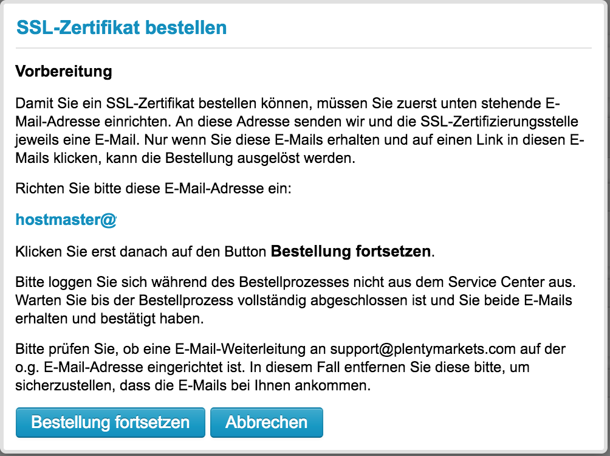

Nach dem Klick auf *“Bestellung fortsetzen”* wird die erste Validierungsmail versendet:
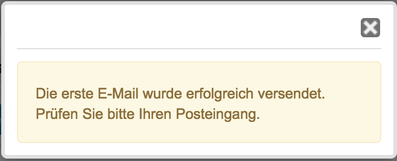

''''
In dieser Email befindet sich ein Bestätigungslink. Nach dem Anklicken dieses Links wird man automatisch ins Service-Center eingeloggt und zur Domain weitergeleitet.

TIP: *Mögliche Fehlerquellen* +
1. _Beim Klicken auf den Link wird ein anderer Browser geöffnet als der, den ich sonst immer verwende._
*Lösung:* Führe den gesamten Bestellvorgang erneut mit dem Browser aus, der sich beim Anklicken des Bestätigungslinks geöffnet hat.

_Beim Klicken auf den Link werde ich nicht automatisch ins Service-Center eingeloggt und zur Domain weitergeleitet._
*Lösung:* Es kann passieren, dass Du nach einer gewissen Zeit automatisch wegen Inaktivität ausgeloggt wirst. Logge Dich vorsichtshalber *vor* dem Anklicken des Links noch einmal im Service-Center ein. Weiterhin ist es ratsam ein mal den gesamten *Browsercache* und alle *Cookies* zu *löschen* gem. Punkt <<Was kann bei der Bestellung schiefgehen?>> in der nachfolgenden Anleitung: link:https://forum.plentymarkets.com/t/loeschen-des-lokalen-dns-cache/64288[Löschen des lokalen DNS-Cache]

==== Der erfolgreiche Abschluss der Bestellung und die Validierung durch den SSL-Provider
Nach Betätigung des Links in der von plentymarkets verschickten Bestätigungsmail wird man automatisch eingeloggt und zur Domain weitergeleitet.

Hier muss die gewünschte Laufzeit des Zertifikats (1 Jahr / 2 Jahre) ausgesucht und der Button  betätigt werden.

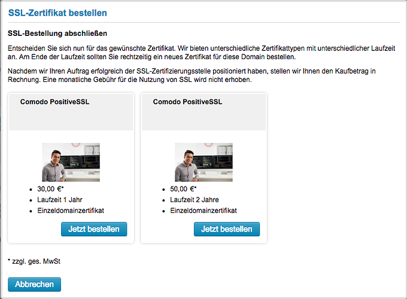

Daraufhin erscheint folgende Meldung:

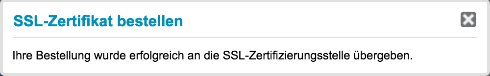

''''

Im Anschluss sendet die Zertifizierungsstelle (COMODO) eine *zweite* E-Mail an *hostmaster@deineDomain.de*.
In dieser E-Mail sind die Bestellinformationen zusammengefasst und der darin enthaltene Link mit der Bezeichnung _here_ muss angeklickt werden (*beachte die in <<Was kann bei der Bestellung schiefgehen?>> beschriebenen möglichen Fehlerquellen*).
Folge den Anweisung des Bildes.

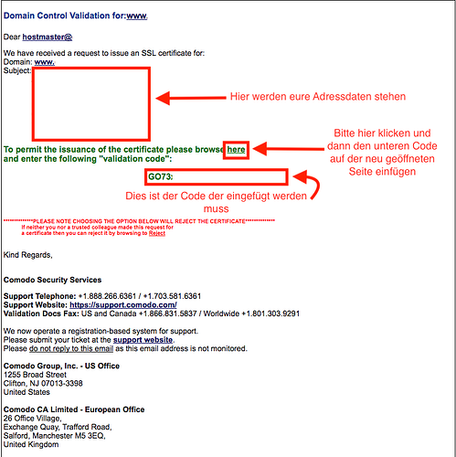

Man wird auf die Bestätigungsseite der Zertifizierungsstelle geleitet:

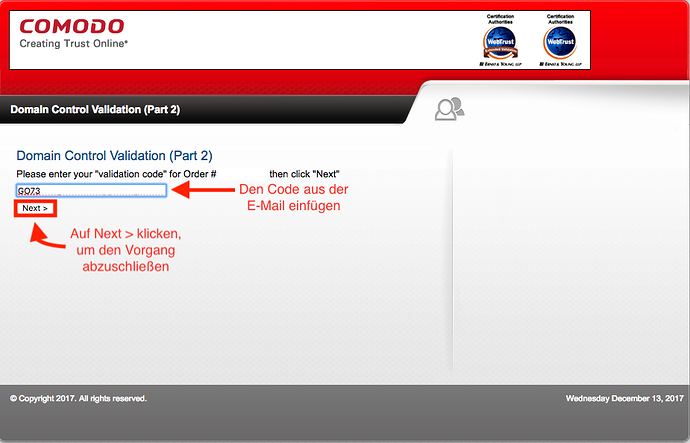

Durch das Einfügen des Codes aus der E-Mail und per Klick auf *Next >* wird die Bestellung finalisiert.

IMPORTANT: Beide E-Mails müssen unbedingt bestätigt werden!

Sobald der Status im Service-Center *done* lautet, ist der Vorgang abgeschlossen und die Domain wird nach dem nächsten Systemprozess über *HTTPS* sicher ausgeliefert.

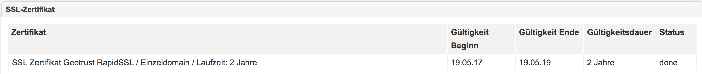

== Was kann bei der Bestellung schiefgehen?

=== Wieso bekomme ich keine erste und/oder zweite Bestätigungsmail?
* Das Postfach hostmaster@deineDomain.tld wurde nicht angelegt bzw. ist nicht erreichbar
* Überprüfe, ob eine Weiterleitung für das Postfach hostmaster@deineDomain.tld eingerichtet wurde und deaktiviere diese (vorübergehend).
* Überprüfe Deinen Spam-Ordner
* Die *zweite* Validierungsmail vom SSL-Provider wird erst *nach* Auswahl des Zertifikats versendet
* Die Bestätigungslinks wurden nicht im selben Browser bestätigt, oder die Sitzung wurde beendet.

.Mögliche Fehlerquellen
****
_Beim Klicken auf den Link wird ein anderer Browser geöffnet als der, den ich sonst immer verwende._ +
*Lösung:* Führe den gesamten Bestellvorgang erneut mit dem Browser aus, der sich beim Anklicken des Bestätigungslinks geöffnet hat. +

_Beim Klicken auf den Link werde ich nicht automatisch ins Service-Center eingeloggt und zur Domain weitergeleitet._ +
*Lösung:* Es kann passieren, dass Du nach einer gewissen Zeit automatisch wegen Inaktivität ausgeloggt wirst. Logge Dich vorsichtshalber *vor* dem Anklicken des Links noch einmal im Service-Center ein. Weiterhin ist es ratsam ein mal den gesamten *Browsercache* und alle *Cookies* zu *löschen* gem. Punkt <<Was kann bei der Bestellung schiefgehen?>> in der nachfolgenden Anleitung: link:https://forum.plentymarkets.com/t/loeschen-des-lokalen-dns-cache/64288[Löschen des lokalen DNS-Cache]
****

=== Wieso lautet der Status im Service-Center “ordered”?
Der im Service-Center benannte Status *ordered* bedeutet, dass die erste Validierungsmail erfolgreich bestätigt wurde. Nach dem Klick auf den Button `Jetzt bestellen` wechselt der Status zu “ordered”. Der Status bleibt so lange auf “ordered”, bis die zweite Validierungsmail erfolgreich bestätigt wurde.
Sollte das E-Mail-Konto korrekt eingerichtet sein und sich die zweite E-Mail weder im Posteingang, noch im Spam-Ordner befinden, melde Dich im nachfolgenden Thread und bitte um die erneute Einleitung zum Versand der *zweiten* Validierungsmail: link:https://forum.plentymarkets.com/t/ssl-status-ordered-2-mail-kommt-nicht/64536[Bestellung SSL - Status “ordered”, 2. Mail kommt nicht]

Erst, nachdem die zweite Validierungsmail erfolgreich bestätigt wurde, wird der Status auf done aktualisiert und die Bestellung war erfolgreich.

=== Wieso lautet der Status im Service-Center “cancelled”?
Nach spätestens 4 Wochen sind die Validierungsmails ungültig und können nicht mehr bestätigt werden. Der Status wird vom Provider auf *cancelled* gesetzt.
Sofern diese Frist nicht eingehalten wurde, kann im Falle einer Kontobelastung der Support im Forum kontaktiert werden. Das bereits bezahlte, aber nicht final bestätigte Zertifikat, wird gutgeschrieben.

Der Bestellvorgang muss erneut durchgeführt werden.

== Häufig gestellte Fragen (FAQ)

[options="header,footer"]
|============================================
|*Frage*: +
*Ich habe LetsEncrypt bereits vor mehreren Stunden bestellt, meine Seite wird aber noch immer nicht als sicher eingestuft - Was kann ich machen?*
|*Antwort (Option 1):* +
Nachdem die Bestellung im Service-Center der Status “done” erhalten hat muss der lokale Browser-Cache geleert werden (link:https://forum.plentymarkets.com/t/loeschen-des-lokalen-dns-cache/64288[Löschen des lokalen Browser- und/oder DNS-Cache]), damit das zwischengespeicherte Zertifikat aktualisiert wird.      
|*Antwort (Option 2):* +
Evtl. liegt bei der Erreichbarkeit Deiner Domain ein Problem vor und das Zertifikat kann deswegen nicht korrekt ausgeliefert werden. Du kannst auf der nachfolgenden Seite prüfen, ob eine Installation von LetsEncrypt für Deine Domain möglich ist: https://letsdebug.net/ >> *Validation method: HTTP-01*. Falls dort eine Fehlermeldung ausgegeben wird kannst Du uns diese gern im Forum mitteilen, damit wir den Sachverhalt prüfen können.
|============================================

[options="header,footer"]
|============================================
|*Frage*: +
*Ich möchte von COMODO auf LetsEncrypt umsteigen - was ist zu beachten?*
|*Antwort:* +
Im Falle einer Bestellung von Let’sEncrypt bei einem bereits aktiven SSL-Zertifikat von COMODO (alias RapidSSL), wird das COMODO-Zertifikat durch das von Let’sEncrypt ersetzt! Das “alte” Zertifikat wird jedoch nicht gelöscht, sondern auf inaktiv geschaltet. Eine Reaktivierung innerhalb des Gültigkeitszeitraums ist durch @plenty-Cloud möglich. Es kann sein, dass die Domain für maximal 1h als “nicht sicher” eingestuft wird, wenn das LetsEncrypt-Zertifikat gerade erst bestellt wurde, da dies nach der Bestellung angefordert, generiert und installiert werden muss. Nachdem die Bestellung im Service-Center der Status “done” erhalten hat muss der lokale Browser-Cache geleert werden, damit das zwischengespeicherte Zertifikat aktualisiert wird.
|============================================

