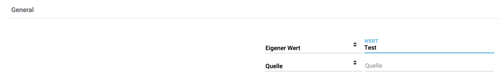
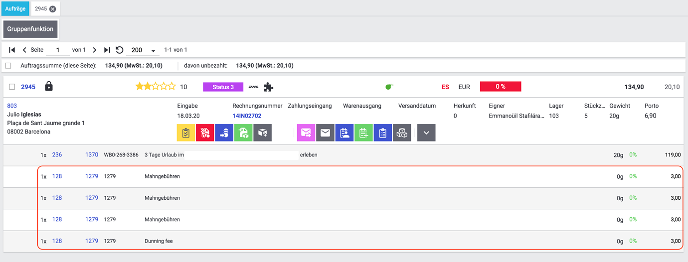
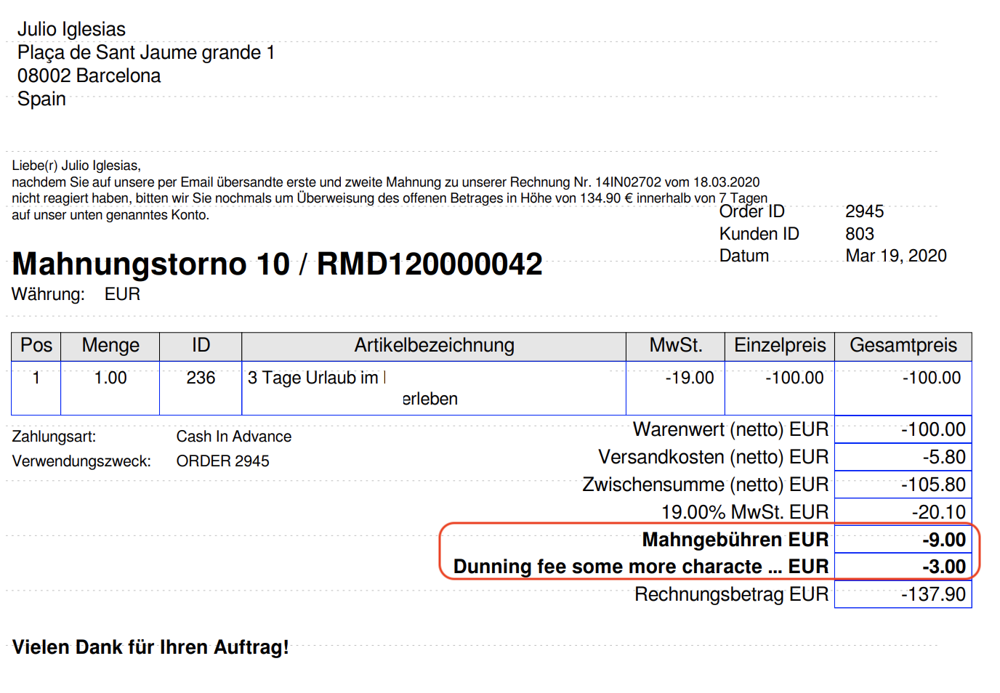

= plentymarkets Changelog
:lang: de
include::{includedir}/_header.adoc[]
:author: kevin-stederoth
:sectnums!:
:position: 150
:url: changelog
:id:
:startWeekDate: 18. März 2020
:endWeekDate: 25. März 2020
:nav-alias: Changelog 25. März 2020

Erfahre, was sich in der Woche vom {startWeekDate} bis zum {endWeekDate} bei plentymarkets getan hat. Im Folgenden findest du alle Changelog-Einträge der letzten Wochen für stable- und early-Systeme.

Wenn du mehr zu den einzelnen Versionen erfahren oder auf eine andere Version wechseln möchtest, siehe die Handbuchseite <<basics/admin-aufgaben/versionszyklus#, Versionszyklus>>. Um die Informationen, die auf dieser Seite gesammelt sind, in Echtzeit zu erhalten, abonniere die link:https://forum.plentymarkets.com/c/changelog[Kategorie Changelog in unserem Forum^].

Wähle, welchen Changelog du sehen möchtest.

[.tabs]
====
stable::
+
--
[discrete]
== Neu

Folgende Neuerungen wurden in den letzten 7 Tagen auf *stable* veröffentlicht.

[discrete]
=== Elastischer Export

* Ab sofort ist es möglich über den FormatDesigner einen Export der Eigenschaften vom Typ Kontakt mit Bezug zur Kontakt-ID zu konfigurieren:
+
ContactProperty wurde als Subtyp des Kontaktformats hinzugefügt und bietet als Filter die ID der Eigenschaft, den Wert der Eigenschaft, den Typ der Eigenschaft, die zur Eigenschaft verlinkte Kontakt-ID sowie die Option, alle zur Eigenschaft gespeicherten Daten zu exportieren.

[discrete]
=== Kataloge

* Ab sofort kann man Kataloge 1:1 kopieren.
* Ab sofort kann man Kataloge für den Export deaktivieren und aktivieren.
* Ab sofort kann man über einen Toggle die nicht obligatorischen Felder ein- und ausblenden. Standardmäßig werden immer nur die Pflichtfelder des jeweiligen Kataloges angezeigt.
* Ab sofort kann man den Katalognamen ändern.
* Ab sofort werden im Katalog bei den einzelnen Bereichen Überschriften ausgegeben.
* Ab sofort können Datenquellen miteinander kombiniert werden. Des Weiteren könnt ihr das Trennzeichen, das zwischen den Quellen stehen soll, beliebig wählen.
+
Weitere Informationen findest du auf der Handbuchseite <<daten/daten-exportieren/kataloge-verwalten#70, Kataloge verwalten>>.
* Ab sofort könnt ihr Eigene Werte exportieren.
+

[discrete]
=== Mahnungsprozess

* Es gibt einen neuen Auftragsposition Typ *dunning charge* für die Mahngebühren (`typeId == 12`). Diese enthält keine Steuerinformationen (immer brutto).
* Die neue Auftragsposition *dunning charge* hat eine Property (`typeId == 3`, Dokumentnummer) mit der Dokumentnummer der Mahnung, für die die Position hinzugefügt wurde.
* Es gibt ein neues Dokument *Mahnungstorno* unter den Standortdokumenten (*Einrichtung » Mandant » Standorte » Dokumente » Stornobeleg Mahnung*), welches die letzte Mahnung storniert.
+
Weitere Informationen findest du auf der Handbuchseite <<auftraege/auftragsdokumente/mahnungen-erzeugen#, Mahnungen>>.

'''

[discrete]
== Geändert

Folgende Änderungen wurden in den letzten 7 Tagen auf *stable* veröffentlicht.

[discrete]
=== Elastischer Export

* Man konnte bislang nur seine ersten 50 Attribute im Attributs-Filter auswählen, dieses Limit wurde nun auf 350 hinauf gesetzt. Im Zuge der Änderung werden die Attribute nun auch alphabetisch sortiert.

[discrete]
=== Kataloge

* Wir haben den Unterpunkt *Bild* in *Alle verfügbaren Bilder* umbenannt.

[discrete]
=== Mahnungsprozess

* Es können maximal 4 Mahnungen erzeugt werden.
* Um eine Mahnung erzeugen zu können, muss eine nicht stornierte Rechnung existieren.
* Solange eine nicht stornierte Mahnung existiert, kann kein Stornobeleg zur Rechnung erzeugt werden.
Die Anzeige der Mahngebühren am Auftrag erfolgt als steuerfreie Summe und nicht als Position in der Artikelliste.
+
[IMPORTANT]
.To-Do
======
Für die erfolgreiche Erzeugung eines Mahnungstornos muss zunächst die Dokument-Einstellung unter *Einrichtung » Mandant » Standorte » Dokumente » Stornobeleg Mahnung* konfiguriert werden
======
+

+

+
Weitere Informationen findest du auf der Handbuchseite <<auftraege/auftragsdokumente/mahnungen-erzeugen#, Mahnungen>>.

[discrete]
=== Prozesse

* Ab sofort wird die Meldung *Keine Aufträge gefunden* nicht mehr als Fehlermeldung ausgegeben. Die Meldungen verschwinden nach kurzer Zeit wieder von allein.

'''

[discrete]
== Behoben

Folgende Probleme wurden in den letzten 7 Tagen auf *stable* behoben.

[discrete]
=== Import

* Wenn man bei Anlage einer neuen Zuordnung nicht auf *Speichern* klickte und das Fenster erneut öffnete, so konnte man nicht auf *Speichern* klicken. Diesen Fehler haben wir nun behoben.

[discrete]
=== Kataloge

* Die Schaltfläche *Quelle entfernen* hatte keine Funktion. Dieses Fehlverhalten haben wir nun behoben.
* Es gab einen Fehler bei der Paginierung. Wenn man z.B. auf Seite 2 klickte, gelangte man auf Seite 1 zurück. Diesen Fehler haben wir behoben.
* War der Sync-Name zu lang, so war kein Abstand zwischen den Buttons Status und Datei-Upload vorhanden. Diesen Fehler haben wir nun behoben.
* Wurde in einem Sync nur eine Zuordnung angelegt und gespeichert, so erschien die Fehlermeldung *Die Positionsnummer ist bereits vergeben*. Diesen Fehler haben wir nun behoben.

'''

[discrete]
== Gelöscht

Folgende Funktionalität wurde in den letzten 7 Tagen auf *stable* gelöscht.

[discrete]
=== Facettensuche

* Der Tab *Such-Index* in den Einstelungen der Facettensuche im Menü *Einrichtung » Mandant » Global » Dienste » Facettensuche* wurde gelöscht, da er nicht mehr gebraucht wird. Einstellungen an der Facettensuche werden im Menü *System » Artikel » Suche » Frontend » Sucheinstellungen* vorgenommen.

--

early::
+
--
[discrete]
== Neu

Folgende Neuerungen wurden in den letzten 7 Tagen auf *early* veröffentlicht.

'''

[discrete]
== Geändert

Folgende Änderungen wurden in den letzten 7 Tagen auf *early* veröffentlicht.

'''

[discrete]
== Behoben

Folgende Probleme wurden in den letzten 7 Tagen auf *early* behoben.

'''

[discrete]
== Gelöscht

Folgende Funktionalität wurde in den letzten 7 Tagen auf *early* gelöscht.

--

Plugin-Updates::
+
--
Folgende Plugins wurden in den letzten 7 Tagen in einer neuen Version auf plentyMarketplace veröffentlicht:

.Plugin-Updates
[cols="2, 1, 2"]
|===
|Plugin-Name
|Version
|To-do

|link:https://marketplace.plentymarkets.com/plugins/sales/marktplaetze/elasticexportcdiscountcom_4738[Cdiscount.com^]
|1.0.23
|-

|link:https://marketplace.plentymarkets.com/plugins/individualisierung/widgets/cfourstorespecialswidget_6363[Shopaktionen Widget^]
|1.0.4
|-

|link:https://marketplace.plentymarkets.com/plugins/integration/simplyletter_5104[Simplyletter^]
|1.5.5
|-

|link:https://marketplace.plentymarkets.com/plugins/payment/sumup_5141[SumUp^]
|1.0.1
|-

|link:https://marketplace.plentymarkets.com/plugins/payment/verifonezvt_5504[VerifoneZVT^]
|1.0.1
|-

|===

Wenn du dir weitere neue oder aktualisierte Plugins anschauen möchtest, findest du eine link:https://marketplace.plentymarkets.com/plugins?sorting=variation.createdAt_desc&page=1&items=50[Übersicht direkt auf plentyMarketplace^].
--
====
