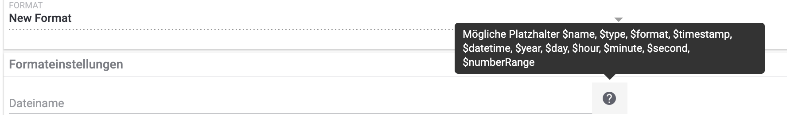

= plentymarkets Changelog
:lang: de
include::{includedir}/_header.adoc[]
:author: kevin-stederoth
:sectnums!:
:position: 150
:url: changelog
:id:
:startWeekDate: 03. Dezember 2020
:endWeekDate: 09. Dezember 2020
:nav-alias: Changelog 09. Dezember 2020

Erfahre, was sich in der Woche vom {startWeekDate} bis zum {endWeekDate} bei plentymarkets getan hat. Im Folgenden findest du alle Changelog-Einträge der letzten Wochen für stable- und early-Systeme.

Wenn du mehr zu den einzelnen Versionen erfahren oder auf eine andere Version wechseln möchtest, siehe die Handbuchseite <<business-entscheidungen/systemadministration/versionszyklus#, Versionszyklus>>. Um die Informationen, die auf dieser Seite gesammelt sind, in Echtzeit zu erhalten, abonniere die link:https://forum.plentymarkets.com/c/changelog[Kategorie Changelog in unserem Forum^]{nbsp}icon:external-link[].

Wähle, welchen Changelog du sehen möchtest.

[.tabs]
====
stable::
+

--

[discrete]
== Neu

Folgende Neuerungen wurden in den letzten 7 Tagen auf *stable* veröffentlicht.

[discrete]
=== Kataloge

* Ab sofort kannst du Platzhalter für Dateinamen verwenden.

[discrete]
=== myView

* Nachdem Administratoren bereits die Möglichkeit haben, Rollen verschiedene Ansichten zuzuweisen, können sie dies nun auch für Benutzer tun.

Nur Admins haben Zugriff auf den Bearbeitungsmodus der MyView und sind somit autorisiert, Ansichten zu erstellen oder zu löschen sowie neue Benutzer anzulegen und Rechte zuzuweisen.

Am Anfang ist immer die Standardansicht vorausgewählt. Existiert eine weitere Ansicht, kann die Standardansicht für einen Benutzer deaktiviert und Rechte für eine andere Ansicht können zugewiesen werden.

Beachte, dass immer mindestens eine Ansicht ausgewählt sein muss.

Die Rechteverwaltung findest du im Menü unter *Einrichtung » Einstellungen » Benutzer » Rechte » Benutzer » Benutzer wählen » Tab: Ansichten*. Dort werden alle benutzerdefinierten Ansichten angezeigt.

*_Tipp:_* Die Rechteverwaltung erreichst du auch direkt aus einer MyView:
Klicke dazu unterhalb der Einstellungen auf Rechteverwaltung » Benutzerrechte.

Viel Spaß mit der neuen Rechteverwaltung und lasst uns gerne Feedback da!

'''

[discrete]
== Behoben

Folgende Fehler wurden in den letzten 7 Tagen auf *early* behoben.

[discrete]
=== Aufträge

* Bei entsperrten Abonnement war es nicht möglich die Adressen zu ändern.
Dies ist nun behoben.

* Die Währung in den neuen UIs für die Nachbestellung und Umbuchung wurde beim Speichern immer zurückgesetzt auf die Systemwährung. Dies wurde behoben.

* Beim Erstellen von Kindsaufträgen (Gutschrift, Gewährleistung usw.) wurden die Set-Referenzen von Set-Komponenten nicht übernommen. Wird das ganze Set und nicht nur Teile davon im Kindsauftrag übernommen, so werden auch die Set-Referenzen an den Positionen erstellt.

[discrete]
=== CRM

* Im englischen Backend sind selbst definierte Kundentypen bei manueller Kundenanlage im Dropdown nicht wählbar gewesen. Dieser Fehler wurde behoben.

[discrete]
=== Warenwirtschaft

* Der Filterbereich im Menü *Einrichtung » Waren » Lager » Lager wählen » Lagerorte* hat bis jetzt nicht ganz richtig funktioniert. Der Fehler wurde behoben.

--

early::
+
--

--

Plugin-Updates::
+
--
Folgende Plugins wurden in den letzten 7 Tagen in einer neuen Version auf plentyMarketplace veröffentlicht:

.Plugin-Updates
[cols="2, 1, 2"]
|===
|Plugin-Name
|Version
|To-do

|link:https://marketplace.plentymarkets.com/mollie_6272[Mollie^]
|2.2.0
|Zur Anlage der Auftragsnotizen wird nun ein Backend-Benutzer benötigt. Durchlaufe bitte erneut den Assistenten, um diesen zu konfigurieren.

|link:https://marketplace.plentymarkets.com/gaxsys_5992[gaxsys Connector^]
|2.2.7
|-

|link:https://marketplace.plentymarkets.com/cfourcontainerpopup5_7007[C4 Popup 5^]
|2.0.1
|-

|link:https://marketplace.plentymarkets.com/ebayfiege_6018[eBay Fulfillment^]
|1.1.26
|-

|link:https://marketplace.plentymarkets.com/io_4696[IO^]
|5.0.16
|-

|link:https://marketplace.plentymarkets.com/ceres_4697[Ceres^]
|5.0.16
|Um bei Live-Shopping-Angeboten auf der Artikelansicht einen Text vor dem Streichpreis anzuzeigen, muss der Übersetzungsschlüssel *crossPriceSpecialOffer* in der Mehrsprachigkeitsoberfläche entsprechend ausgefüllt werden.

|link:https://marketplace.plentymarkets.com/klarna_6731[Klarna^]
|1.0.15
|-

|link:https://marketplace.plentymarkets.com/hermesshippinginterface_5437[Hermes^]
|1.0.7
|-

|link:https://marketplace.plentymarkets.com/rewe_5901[REWE^]
|1.24.2
|-

|link:https://marketplace.plentymarkets.com/mirakl_6917[Mirakl Connector^]
|1.1.6
|-

|link:https://marketplace.plentymarkets.com/voelknerextension_6949[Voelkner^]
|1.1.6
|-

|link:https://marketplace.plentymarkets.com/conradextension_6948[Conrad^]
|1.1.4
|-

|link:https://marketplace.plentymarkets.com/formatdesigner_6483[FormatDesigner^]
|1.0.30
|-

|===

Wenn du dir weitere neue oder aktualisierte Plugins anschauen möchtest, findest du eine link:https://marketplace.plentymarkets.com/plugins?sorting=variation.createdAt_desc&page=1&items=50[Übersicht direkt auf plentyMarketplace^]{nbsp}icon:external-link[].

--

====
