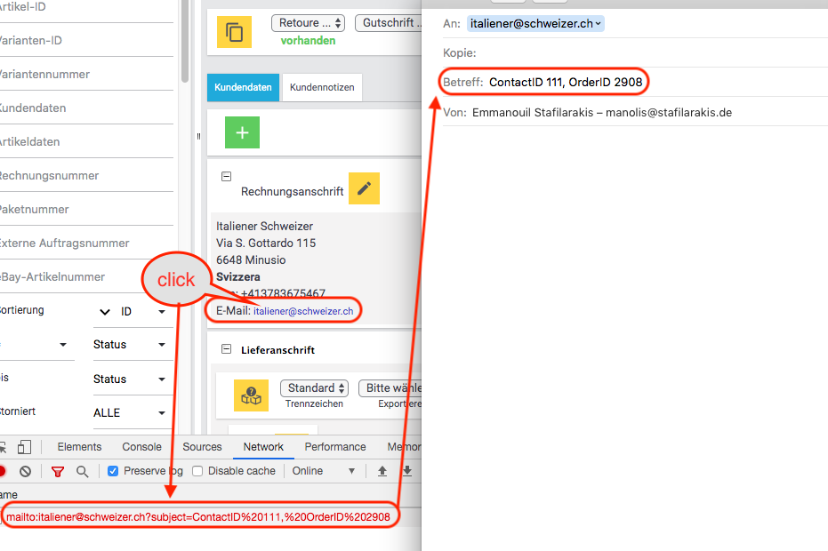
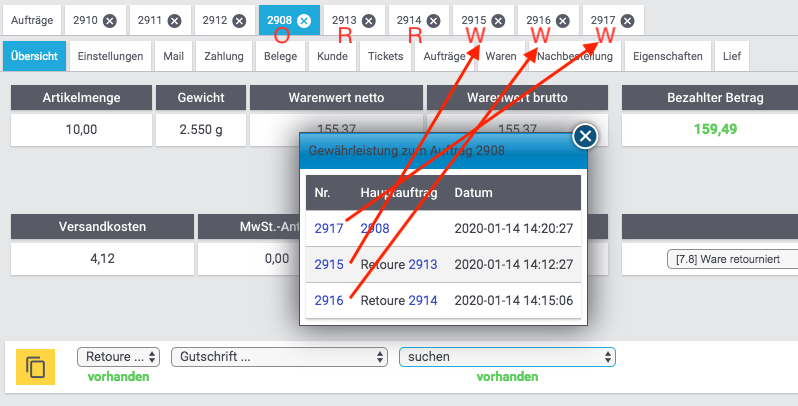

= plentymarkets Changelog
:lang: de
include::{includedir}/_header.adoc[]
:position: 150
:url: changelog
:id: 
:nav-alias: Changelog 29. Januar 2020

Erfahre, was sich diese Woche bei plentymarkets getan hat. Im Folgenden findest du alle Changelog-Einträge der letzten Wochen für stable- und early-Systeme.

Wenn du mehr zu den einzelnen Versionen erfahren oder auf eine andere Version wechseln möchtest, siehe die Handbuchseite <<basics/admin-aufgaben/versionszyklus#, Versionszyklus>>.

== stable

In diesem Bereich findest du alles, was in der letzten Woche auf *stable* veröffentlicht wurde.

=== Neu

[discrete]
==== Facettensuche

* Facettenwerte können nun mit Auswahlwerten von Auswahleigenschaften verknüpft werden.

[discrete]
==== Prozesse

* Es ist nun möglich, die Prozesse-Ansicht für einzelne Prozesse direkt über die URL anzusteuern, z.B.: +
`/processes/execution/5`

* Die Kategorien wurden ebenfalls mit einer ID ausgestattet, sodass man auch diese nun durch direkte URL-Pfade ansteuern kann, z.B: +
`/processes/category/1`

=== Geändert

[discrete]
==== Auftragsübersicht

* In der Auftragsübersicht gibt es Dropdown-Listen zum Erzeugen von Retouren, Gutschriften und Gewährleistungen. Direkt unterhalb jeder Dropdown-Liste wird angezeigt, ob bereits Retouren, Gutschriften und Gewährleistungen vorhanden sind.
+
Wenn Gewährleistungen vorhanden sind, kann man in der Dropdown-Liste die Option *Suchen* auswählen. Dadurch erscheinen in einem Overlay die Gewährleistungen zum Auftrag. Wenn allerdings die Gewährleistung nicht direkt aus dem Auftrag sondern aus einer Retoure zum Auftrag erzeugt wurde, wurde diese nicht angezeigt.
+
Dies wurde nun angepasst, sodass man auch Gewährleistungen zu den Retouren eines Auftrages sehen kann. Hier ein Beispiel (“O” für Auftrag (Order), “R” für Retoure und “W” für Gewährleistung (Warranty)):
+
Dabei ist 2908 der Auftrag, 2917 eine Gewährleistung direkt am Auftrag, 2913 eine Retouren zum Auftrag 2908 und 2915 eine Gewährleistung zur Retoure 2913, 2914 eine weitere Retoure zum Auftrag 2908 und 2916 eine Gewährleistung zur Retoure 2914.
+

+
Die verlinkten E-Mail Adressen in der Auftragsübersicht unter Rechnungsadresse und Lieferadresse enthalten nun auch Informationen zum Kontakt (ContactID, wenn Kontakt vorhanden) und zum Auftrag (OrderID).
+

discrete]
==== OTTO

* Die aktuelle Version der Merkmalsstrukur-Master-Datei vom 24.01.2020 von OTTO wurde eingespielt. Dadurch wurden für Attribut- und Merkmalverknüpfung neue Verknüpfungsmöglichkeiten und Vorgabewerte bereitgestellt. link:https://plentymarkets-discourse.s3.dualstack.eu-central-1.amazonaws.com/original/3X/e/f/ef5aa1d6cbc2decc887227735ada37d65f26a9ba.xlsx[Die Datei könnt ihr hier herunterladen und als Referenz nutzen.^]

=== Behoben

[discrete]
==== Aufträge

* Unter bestimmten Umständen wurde bei der Datenbereinigung von Aufträgen ein Fremdschlüssel nicht korrekt beachtet, sodass manche Aufträge nicht gelöscht wurden (dazu gab es critical Einträge im Log). Dies wurde nun gefixt.

[discrete]
==== Auftragsdokumente

* Wenn der Platz am Ende der Seite nicht für das Variantenbild ausgereicht hat, wurde dieses nur zum Teil auf der Folgeseite dargestellt. Dies wurde nun gefixt.

== early

In diesem Bereich findest du alles, was in der letzten Woche auf *early* veröffentlicht wurde.

=== Neu

=== Geändert

[discrete]
==== plentymarkets System
Es ist uns gelungen, die Ladezeit des Backends nach dem Anmelden um 58% zu reduzieren.

=== Behoben

=== Gelöscht

== Plugin-Updates

Folgende Plugins wurden in den letzten 7 Tagen in einer neuen Version auf plentyMarketplace veröffentlicht:

.Plugin-Updates
[cols="2, 1, 2"]
|===
|Plugin-Name
|Version
|To-do

|link:https://marketplace.plentymarkets.com/plugins/individualisierung/themes/cfourceresfurniture_5397[Ceres Furniture^]
|4.5.0
|-

|link:https://marketplace.plentymarkets.com/plugins/integration/enderecoaddressautocomplete_6622[Endereco Address Autocomplete^]
|1.0.3
|-

|link:https://marketplace.plentymarkets.com/plugins/sales/preisportale/elasticexportidealode_4723[idealo.de]
|1.1.14
|-

|link:https://marketplace.plentymarkets.com/plugins/sales/marktplaetze/pulpo_6616[Pulpo WMS^]
|1.0.5
|-

|link:https://marketplace.plentymarkets.com/plugins/sales/online-shops/woocommerce_5102[WooCommerce^]
|2.0.0
|-

|===
