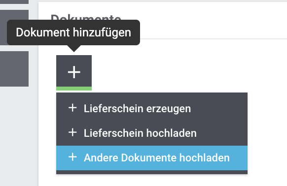

= plentymarkets Changelog
:lang: de
include::{includedir}/_header.adoc[]
:author: kevin-stederoth
:sectnums!:
:position: 150
:url: changelog
:id:
:startWeekDate: 02. April 2020
:endWeekDate: 08. April 2020
:nav-alias: Changelog 08. April 2020

Erfahre, was sich in der Woche vom {startWeekDate} bis zum {endWeekDate} bei plentymarkets getan hat. Im Folgenden findest du alle Changelog-Einträge der letzten Wochen für stable- und early-Systeme.

Wenn du mehr zu den einzelnen Versionen erfahren oder auf eine andere Version wechseln möchtest, siehe die Handbuchseite <<basics/admin-aufgaben/versionszyklus#, Versionszyklus>>. Um die Informationen, die auf dieser Seite gesammelt sind, in Echtzeit zu erhalten, abonniere die link:https://forum.plentymarkets.com/c/changelog[Kategorie Changelog in unserem Forum^].

Wähle, welchen Changelog du sehen möchtest.

[.tabs]
====
stable::
+
--
[discrete]
== Neu

Folgende Neuerungen wurden in den letzten 7 Tagen auf *stable* veröffentlicht.

[discrete]
=== Bestellungen

* Bei Umbuchungen und Nachbestellungen (*Waren » Bestellung*), wurde die Möglichkeit hinzugefügt, eigene Dateien hochzuladen.
+

[discrete]
=== Elastischer Export

* Du kannst ab jetzt im elastischen Export nach dem Land von Kontakten filtern.

[discrete]
=== Import

* Im Menü *Daten » Import* haben wir unter Einstellungen, Abgleich und Zuordnung die Möglichkeit hinzugefügt, vor Ausführung eines Syncs zu prüfen, ob dieser einen Fehler enthält, wie z.B. keine aktiven Zuordnungen. Diesen Fehler könnt ihr außerdem kopieren und zum Beispiel direkt ins Forum einfügen.
* Ab sofort findet ihr in der Detailansicht der Status-UI das komplette Protokoll eines durchgelaufenen Syncs. Sollten Fehler aufgetreten sein, könnt ihr das Protokoll direkt kopieren und z.B. im Forum einfügen. Dies reduziert den Supportaufwand erheblich.

'''

[discrete]
== Geändert

Folgende Änderungen wurden in den letzten 7 Tagen auf *stable* veröffentlicht.

[discrete]
=== Retourenlabels

* Bisher wurden im Versand-Center zwar alle über einen Retourenauftrag angemeldeten Retourenlabels im Hauptauftrag angezeigt, jedoch im Retourenauftrag selbst nur das Retourenlabel, das als erstes angemeldet wurde.
+
Dieses Verhalten wurde geändert, sodass im Versand-Center alle Retourenlabels, die über den Retourenauftrag erzeugt wurden, auch in diesem Retourenauftrag angezeigt werden und die Gesamtheit aller Retourenlabels (inklusive der Retourenlabels, die über den Hauptauftrag erzeugt wurden) am Hauptauftrag angezeigt werden.

[discrete]
=== OTTO

:otto-master-date: 27.03.2020
:otto-master-link: https://plentymarkets-discourse.s3.dualstack.eu-central-1.amazonaws.com/original/3X/e/4/e46b27f140ece43452372ebdd108e2ad909c6073.xlsx

include::changelog/_textblocks/otto-master-file.adoc[]

'''

[discrete]
== Behoben

Folgende Probleme wurden in den letzten 7 Tagen auf *stable* behoben.

[discrete]
=== Eigenschaften

* Wir haben den Bereich Eigenschaften an der Variante überarbeitet und verschiedene Fehler bzgl. der Verknüpfung, Vererbung und Speicherung behoben.

[discrete]
=== Kataloge

* Wollte man Werte kombinieren, so war es nicht möglich ein Leerzeichen als Trennzeichen zu verwenden. Diesen Fehler haben wir behoben.

--

early::
+
--
[discrete]
== Neu

Folgende Neuerungen wurden in den letzten 7 Tagen auf *early* veröffentlicht.

'''

[discrete]
== Geändert

Folgende Änderungen wurden in den letzten 7 Tagen auf *early* veröffentlicht.

'''

[discrete]
== Behoben

Folgende Probleme wurden in den letzten 7 Tagen auf *early* behoben.

--

Plugin-Updates::
+
--
Folgende Plugins wurden in den letzten 7 Tagen in einer neuen Version auf plentyMarketplace veröffentlicht:

.Plugin-Updates
[cols="2, 1, 2"]
|===
|Plugin-Name
|Version
|To-do

|link:https://marketplace.plentymarkets.com/plugins/individualisierung/widgets/shippingicons_6782[Ceres Beautifier: Shipping Icons^]
|1.0.0
|-

|link:https://marketplace.plentymarkets.com/plugins/individualisierung/widgets/cfourfullcrossselling_6125[Crossselling Artikellisten für die Produkt Seite^]
|1.1.10
|-

|link:https://marketplace.plentymarkets.com/plugins/sales/marktplaetze/elasticexportkaufluxde_4737[kauflux.de]
|1.1.8
|-

|link:https://marketplace.plentymarkets.com/plugins/individualisierung/widgets/cfourfacebookpixel_6392[Facebook Pixel mit Tracking Events^]
|1.1.0
|-

|link:https://marketplace.plentymarkets.com/plugins/integration/pricemonitorplentyintegration_6217[Pricemonitor^]
|1.0.5
|-

|link:https://marketplace.plentymarkets.com/plugins/payment/santanderpaymentsolutions_6231[Santander Payment Solutions^]
|1.4.0
|-

|link:https://marketplace.plentymarkets.com/plugins/individualisierung/widgets/cfourwhatsappshare_5323[Whatsapp Share Button^]
|1.1.0
|-

|===

Wenn du dir weitere neue oder aktualisierte Plugins anschauen möchtest, findest du eine link:https://marketplace.plentymarkets.com/plugins?sorting=variation.createdAt_desc&page=1&items=50[Übersicht direkt auf plentyMarketplace^].
--
====
