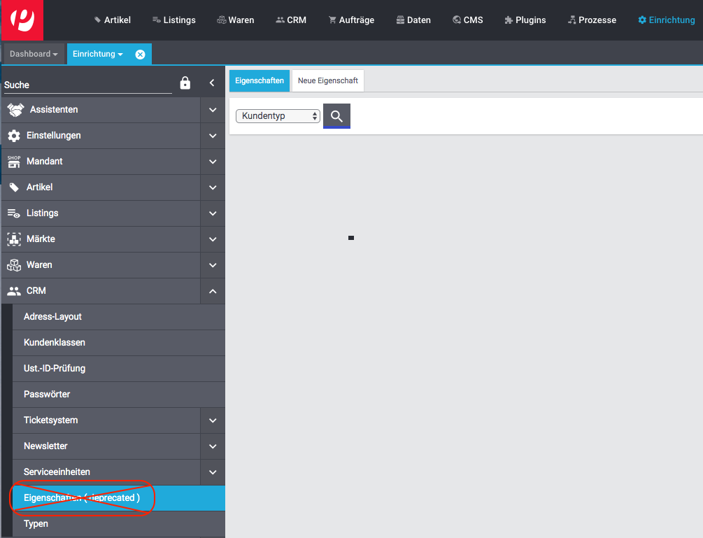
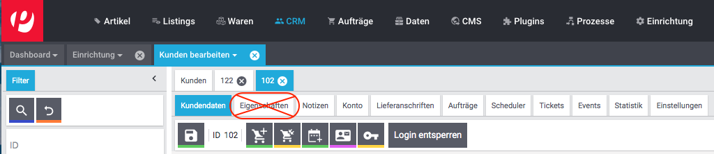

= plentymarkets Changelog
:lang: de
include::{includedir}/_header.adoc[]
:author: kevin-stederoth
:sectnums!:
:position: 150
:url: changelog
:id:
:startWeekDate: 09. April 2020
:endWeekDate: 15. April 2020
:nav-alias: Changelog 15. April 2020

Erfahre, was sich in der Woche vom {startWeekDate} bis zum {endWeekDate} bei plentymarkets getan hat. Im Folgenden findest du alle Changelog-Einträge der letzten Wochen für stable- und early-Systeme.

Wenn du mehr zu den einzelnen Versionen erfahren oder auf eine andere Version wechseln möchtest, siehe die Handbuchseite <<basics/admin-aufgaben/versionszyklus#, Versionszyklus>>. Um die Informationen, die auf dieser Seite gesammelt sind, in Echtzeit zu erhalten, abonniere die link:https://forum.plentymarkets.com/c/changelog[Kategorie Changelog in unserem Forum^].

Wähle, welchen Changelog du sehen möchtest.

[.tabs]
====
stable::
+
--
[discrete]
== Neu

Folgende Neuerungen wurden in den letzten 7 Tagen auf *stable* veröffentlicht.

[discrete]
=== Aufträge

* Die Status-Dropdowns in der aktuellen Auftrags-UI (*Aufträge bearbeiten*) wurden vereinheitlicht und zeigen die für den aktuellen Benutzer setzbaren Status.

[discrete]
=== eBay

* Du kannst ab jetzt deine Bilder am Artikel nicht nur für eBay generell freischalten, sondern kannst nun auch zwischen den einzelnen Plattformen wählen. Damit eine Plattform in der Verfügbarkeitsliste der Bilder auftauchen kann, muss sie unter *Einrichtung » Aufträge » Auftragsherkunft* freigeschaltet sein. Die Verfügbarkeiten sind bereits vor kurzem still und heimlich aufgetaucht aber ab jetzt werden diese auch für das Hochladen der Bilder bei eBay berücksichtigt.

[discrete]
=== Kundeneigenschaften

* Die “alten” Kundeneigenschaften, die im Menü *Einrichtung » CRM » Eigenschaften (deprecated)* erstellt wurden, kannst du in das Menü *Einrichtung » Einstellungen » Eigenschaften* migrieren.
+
Den Zeitpunkt der Migration bestimmst du selbst: Im Menü *Einrichtung » Einstellungen » Daten » Migration* findest du den Bereich *Kundeneigenschaften* . Mit einem Klick auf *Migration starten* wird die Migration der Kundeneigenschaften ausgeführt. Die Migration kann nur einmal ausgeführt werden, weshalb die Funktion anschließend nicht mehr verfügbar ist.
+
[IMPORTANT]
.To-Do
======
Du hast Zeit, die Migration der Kundeneigenschaften bis zur Abkündigung der UI *CRM » Kunden bearbeiten (deprecated)* auszuführen. Wir kündigen die Abschaltung dieser UI rechtzeitig in der Changelog-Kategorie an und werden euch noch einmal rechtzeitig an die Abschaltung erinnern.
In dem o.g. Migrationsmenü kannst du außerdem entscheiden, ob du die Eigenschaften vom Typ *Kontakt*, die du bereits im Menü *Einrichtung » Einstellungen » Eigenschaften* erstellt hast, sowie alle Werte und bestehenden Verknüpfungen zu Kontakten vor der Migration löschen möchtest, um ggf. doppelte Einträge zu vermeiden.
======
+
Im Zuge der Migration werden die folgenden Menüpunkte entfernt:
+
Menü *Einrichtung » CRM » Eigenschaften (deprecated)*:
+

+
Tab Eigenschaften in der UI *CRM » Kunden bearbeiten (deprecated)*:
+

* Ab sofort kann man für Kundeneigenschaften, Optionen wie Pflichtfeld etc. setzen.

[discrete]
=== Zahlungsarten

* Momentan werden standardmäßig nur aktive Plugin-Zahlungsarten in den Dropdown-Listen im Backend ausgegeben. Es gibt nun eine neue Option unter *Einrichtung » Aufträge » Einstellungen* mit der es möglich ist auch inaktive Plugin-Zahlungsarten ausgeben zu lassen.

'''

[discrete]
== Geändert

Folgende Änderungen wurden in den letzten 7 Tagen auf *stable* veröffentlicht.

'''

[discrete]
== Behoben

Folgende Probleme wurden in den letzten 7 Tagen auf *stable* behoben.

[discrete]
=== Sammelrechnungen

* Wenn die Sammelrechnung bei Anlage eines Sammelauftrages per Ereignisaktion erzeugt wurde, fehlten die Einzelrechnungen darin, da die Referenzen der Einzelaufträge zum Sammelauftrag fehlten. Dies wurde behoben, die Referenzen stehen bei Anlage des Sammelauftrages zur Verfügung.

--

early::
+
--
[discrete]
== Neu

Folgende Neuerungen wurden in den letzten 7 Tagen auf *early* veröffentlicht.

'''

[discrete]
== Behoben

Folgende Probleme wurden in den letzten 7 Tagen auf *early* behoben.

--

Plugin-Updates::
+
--
Folgende Plugins wurden in den letzten 7 Tagen in einer neuen Version auf plentyMarketplace veröffentlicht:

.Plugin-Updates
[cols="2, 1, 2"]
|===
|Plugin-Name
|Version
|To-do

|
|
|

|===

Wenn du dir weitere neue oder aktualisierte Plugins anschauen möchtest, findest du eine link:https://marketplace.plentymarkets.com/plugins?sorting=variation.createdAt_desc&page=1&items=50[Übersicht direkt auf plentyMarketplace^].
--
====
