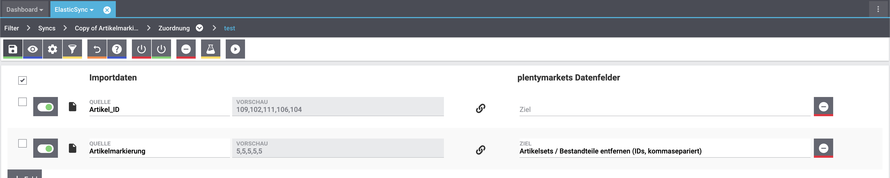

= plentymarkets Changelog
:lang: de
include::{includedir}/_header.adoc[]
:author: none
:sectnums!:
:position: 150
:url: changelog
:id:
:startWeekDate: 13. Februar 2020
:endWeekDate: 19. Februar 2020
:nav-alias: Changelog 19. Februar 2020

Erfahre, was sich in der Woche vom {startWeekDate} bis zum {endWeekDate} bei plentymarkets getan hat. Im Folgenden findest du alle Changelog-Einträge der letzten Wochen für stable- und early-Systeme.

Wenn du mehr zu den einzelnen Versionen erfahren oder auf eine andere Version wechseln möchtest, siehe die Handbuchseite <<basics/admin-aufgaben/versionszyklus#, Versionszyklus>>. Um die Informationen, die auf dieser Seite gesammelt sind, in Echtzeit zu erhalten, abonniere die link:https://forum.plentymarkets.com/c/changelog[Kategorie Changelog in unserem Forum^].

== stable

In diesem Bereich findest du alles, was in der letzten Woche auf *stable* veröffentlicht wurde.

=== Geändert

[discrete]
==== ElasticSync

* Die Schaltflächen *Ausführen* und *Testen* befinden sich nun wieder wie gewohnt auf der linken Seite. Gleiches gilt für den Toggle für das aktivieren und deaktivieren der Importfelder.
+

=== Behoben

[discrete]
==== Nachbestellung

* Die Reihenfolge der Ergebnisse bei der Suche der Nachbestellungen war nicht korrekt. Das wurde angepasst.

* Das Lieferdatum in den Nachbestellungen wurde trotz Speichern beim Auslösen und Abschließen der Bestellung verworfen. Dieses Verhalten wurde behoben.

[discrete]
==== Prozesse

* Der Filter *Aktuelle Rechnung* in den Prozessen hat nicht korrekt gearbeitet sobald am Auftrag eine externe Rechnung verknüpft war. Dieses Verhalten wurde nun behoben.

* Es wurde ein Bug gefixt der dafür sorgte, dass es beim Tabwechsel zu einer Verzögerung von 1-2 Sekunden kommen konnte.

== early

In diesem Bereich findest du alles, was in der letzten Woche auf *early* veröffentlicht wurde.

=== Behoben

[discrete]
==== Spezialexport Collmex

* Wenn Rechnungen einen Präfix in der Rechnungsnummer haben, wurden stornierte Rechnungen nicht im Export ausgegeben, denn es kam zu einem Fehler im Abgleich der Rechnungsnummer (einmal mit und einmal ohne den Präfix).

== Plugin-Updates

Folgende Plugins wurden in den letzten 7 Tagen in einer neuen Version auf plentyMarketplace veröffentlicht:

.Plugin-Updates
[cols="2, 1, 2"]
|===
|Plugin-Name
|Version
|To-do

|link:https://marketplace.plentymarkets.com/plugins/payment/amazonloginandpay_5072[Amazon Pay^]
|1.5.4
|-

|link:https://marketplace.plentymarkets.com/plugins/individualisierung/widgets/filterdrop_6603[Ceres Beautifier: FilterDrop^]
|2.0.0
|-

|link:https://marketplace.plentymarkets.com/plugins/payment/invoice_4760[Kauf auf Rechnung^]
|2.0.3
|

|link:https://marketplace.plentymarkets.com/plugins/payment/skrill_5142[Skrill^]
|1.0.23
|-

|link:https://marketplace.plentymarkets.com/plugins/payment/wallee_5038[wallee E-Commerce Hub^]
|2.0.9
|-

|===

Wenn du dir weitere neue oder aktualisierte Plugins anschauen möchtest, findest du eine link:https://marketplace.plentymarkets.com/plugins?sorting=variation.createdAt_desc&page=1&items=50[Übersicht direkt auf plentyMarketplace^].
