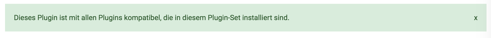

= plentymarkets Changelog
:lang: de
include::{includedir}/_header.adoc[]
:author: kevin-stederoth
:sectnums!:
:position: 150
:url: changelog
:id:
:startWeekDate: 07. Mai 2020
:endWeekDate: 13. Mai 2020
:nav-alias: Changelog 13. Mai 2020

Erfahre, was sich in der Woche vom {startWeekDate} bis zum {endWeekDate} bei plentymarkets getan hat. Im Folgenden findest du alle Changelog-Einträge der letzten Wochen für stable- und early-Systeme.

Wenn du mehr zu den einzelnen Versionen erfahren oder auf eine andere Version wechseln möchtest, siehe die Handbuchseite <<business-entscheidungen/systemadministration/versionszyklus#, Versionszyklus>>. Um die Informationen, die auf dieser Seite gesammelt sind, in Echtzeit zu erhalten, abonniere die link:https://forum.plentymarkets.com/c/changelog[Kategorie Changelog in unserem Forum^]{nbsp}icon:external-link[].

Wähle, welchen Changelog du sehen möchtest.

[.tabs]
====
stable::
+
--
[discrete]
== Neu

Folgende Neuerungen wurden in den letzten 7 Tagen auf *stable* veröffentlicht.

[discrete]
=== Aufträge

* Die Ereignisaktionen wurden um die Ereignisse `Externe Rechnung hochgeladen` und `Externe Gutschrift hochgeladen` erweitert.
* Es wird bei Aufträgen eine Warnung angezeigt, wenn eine Zahlung aber keine Rechnung existiert. Dies ist auch bei Gutschriften ohne Gutschrift-Dokument der Fall.

[discrete]
=== Import

* Im Sync des Typs Attribut sind weitere Sprachen für den Import hinzugefügt worden

[discrete]
=== Kontakte

* Im Filterbereich in den Menüs *CRM » Kontakte* und *CRM » Schnellsuche* wurde im Filter *Land* die Einstellung *Alle außer Deutschland* hinzugefügt. Wenn du diese Filtereinstellung wählst, werden Kontakte aus allen Ländern außer Deutschland angezeigt.
* In den Menüs *CRM » Kontakte* und *CRM » Schnellsuche* werden in der Übersicht zusätzlich zu den bisherigen Daten ab sofort auch die Bewertung und die Kundenklasse angezeigt.

[discrete]
=== Plugins

* Du kannst ab jetzt Plugins in der neuen Plugin-UI aktualisieren.
+
Außerdem wird ab jetzt sowohl vor dem Aktualisieren als auch vor dem Installieren von Plugins geprüft, ob alle anderen Plugins, die für die ausgewählte Version benötigt werden, bereits in dem Plugin-Set vorliegen.
+

+
Um ein Plugin-Set in der neuen UI zu bearbeiten, öffne das Menü *Plugins » Plugin-Set-Übersicht (Alpha)* und klicke auf die Schaltfläche *Plugin-Set bearbeiten*.
+
Wir freuen uns bereits auf dein Feedback. Wenn du die neue UI erkundest und dir etwas auffällt, das gut, schlecht oder auch total unverständlich ist, freuen wir uns auf eine entsprechende Rückmeldung link:https://forum.plentymarkets.com/t/feedback-neue-plugin-ui-feedback-for-new-plugin-ui/579903[im zugehörigen Thema im Forum in der Kategorie Plugin-Einrichtung^].

'''

[discrete]
== Geändert

Folgende Änderungen wurden in den letzten 7 Tagen auf *stable* veröffentlicht.

[discrete]
=== Aufträge

* Es ist nicht mehr möglich, einer Gutschrift eine Soll-Zahlung zuzuordnen.

'''

[discrete]
== Behoben

Folgende Probleme wurden in den letzten 7 Tagen auf *stable* behoben.

[discrete]
=== Artikel

* Es kam zu dem Fehler, dass wenn alle Bildverfügbarkeiten bis auf eine gesetzt werden sollten, trotzdem alle gesetzt wurden. Durch den Fix werden nur genau die Verfügbarkeiten gesetzt, die angegeben sind.

[discrete]
=== Aufträge

* In der Auftragssuche wurde ein fehlerhafter Sendungsverfolgungslink generiert mit doppelten Paketnummern. Dieses Problem wurde behoben.

[discrete]
=== Import

* Es ist nun wieder möglich, die Vererbung der Felder für die Artikelauflistung per Import zu aktivieren.

[discrete]
=== Newsletter

* Beim Löschen von Newsletter Ordnern mit vorhandenen Newsletter Anmeldungen wurde die gespeicherte Ordner-ID am entsprechendem Kontakt nicht mit entfernt. Dieses Fehlverhalten wurde behoben.

[discrete]
=== OTTO market

* Unter seltenen Konstellationen konnte das Stornieren eines Auftrages zu einem Fehler führen, so z.B. wenn der Auftrag bereits gelöscht ist oder schon den zu setzenden Storno-Status bereits hat. Dies wurde behoben.

--

early::
+
--
[discrete]
== Neu

Folgende Neuerungen wurden in den letzten 7 Tagen auf *early* veröffentlicht.

'''

[discrete]
== Geändert

Folgende Änderungen wurden in den letzten 7 Tagen auf *early* veröffentlicht.

'''

[discrete]
== Behoben

Folgende Probleme wurden in den letzten 7 Tagen auf *early* behoben.

--

Plugin-Updates::
+
--
Folgende Plugins wurden in den letzten 7 Tagen in einer neuen Version auf plentyMarketplace veröffentlicht:

.Plugin-Updates
[cols="2, 1, 2"]
|===
|Plugin-Name
|Version
|To-do

|link:https://marketplace.plentymarkets.com/plugins/sales/allegropl_6718[AllegroPL^]
|1.0.11
|-

|link:https://marketplace.plentymarkets.com/artikelpdf_6601[Artikel PDF^]
|1.1.0
|-

|link:https://marketplace.plentymarkets.com/feed4multicontentwidget_6816[Feed4MultiContentWidget]
|1.0.0
|-

|link:https://marketplace.plentymarkets.com/gaxsysindependent_6802[gax-Independent^]
|1.0.1
|-

|link:https://marketplace.plentymarkets.com/matrixvarianten_6620[Mehrere Varianten gleichzeitig in den Warenkorb legen^]
|1.1.0
|-

|link:https://marketplace.plentymarkets.com/metro_6600[Metro^]
|1.4.2
|-

|link:https://marketplace.plentymarkets.com/multicontentwidget_6082[Multicontent-Widget^]
|4.1.2
|-

|link:https://marketplace.plentymarkets.com/paypal_4690[PayPal^]
|5.0.3
|-

|link:https://marketplace.plentymarkets.com/plentybasebeta_6358[plentyBase beta^]
|1.7.0
a| * Auf macOS sollte plentyBase vor dem Update auf die neue Version beendet werden, da sich der Installationsweg geändert hat.
* Auf macOS muss Java (empfohlen: Version 8) installiert sein, bevor das Update auf die neue Version durchgeführt wird.

|link:https://marketplace.plentymarkets.com/cfourproductwall_5762[Produktwand Widget^]
|1.0.8
|-

|link:https://marketplace.plentymarkets.com/rewe_5901[REWE^]
|1.19.5
|-

|link:https://marketplace.plentymarkets.com/shopify_4944[Shopify.com^]
|2.2.0
|-

|link:https://marketplace.plentymarkets.com/plugins/individualisierung/widgets/trustedshops_4962[Trusted Shops Review Toolkit^]
|2.0.0
|-

|===

Wenn du dir weitere neue oder aktualisierte Plugins anschauen möchtest, findest du eine link:https://marketplace.plentymarkets.com/plugins?sorting=variation.createdAt_desc&page=1&items=50[Übersicht direkt auf plentyMarketplace^]{nbsp}icon:external-link[].
--

App::
+
--

[discrete]
== Behoben

Folgende Probleme wurden in Version 1.1.10 der *plentymarkets App* behoben.

* Vereinzelt wurden während der Erstellung des Tagesabschlussberichts korrupte Daten geladen und der Tagesabschluss konnte nicht erstellt werden. Dieses Verhalten wurde behoben.

--

====
