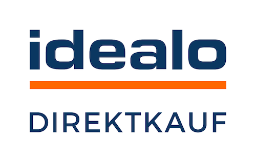

= Märkte und Preisportale
:lang: de
include::{includedir}/_header.adoc[]
:keywords: Marktplatz, Marktplatz, Marktplätze, Marktplätze, Multi-Channel, Multichannel, Preisportal, Preissuchmaschine, Märkte, Märkte, Markt, Markt, Preisportale, Preisportale, Preisportal, Preisportal
:description: Multi-Channel in plentymarkets: Schnittstellen zu allen verfügbaren Vertriebskanälen, wie Marktplätzen und Preisportalen, einrichten.
:position: 110
:url: maerkte
:id: MFX1Q1C
:nav-alias: Übersicht
:author: team-plenty-channel

In diesem Themenbereich findest du jeden Vertriebskanal, zu dem es eine Schnittstelle in plentymarkets gibt. Alle Einstellungen, die du für den gewählten Kanal vornehmen musst, werden beschrieben. Wähle einen Vertriebskanal und beginne mit der Einrichtung.

[TIP]
.Weitere Marktplätze als Plugins verfügbar
====
Einige Marktplätze werden als Plugin in plentymarkets eingebunden. Die Marktplatz-Plugins findest du im link:https://marketplace.plentymarkets.com/plugins/sales/marktplaetze[plentyMarketplace^]. +
Außerdem findest du im plentyMarketplace weitere Plugins von Drittanbietern.
====

==  Märkte einrichten

[.logoList]
//  Markt: amazon
* <<maerkte/amazon/amazon-einrichten#, >>
//  Markt: ebay
* <<maerkte/ebay/ebay-einrichten#, image:maerkte/assets/ebay-logo.png[]>>
//  Markt: bol.com
* <<maerkte/bol-com#, image:maerkte/assets/bol-com-logo.png[]>>
//  Markt: CDiscount
* <<maerkte/cdiscount#, image:maerkte/assets/Logo-Cdiscount-web.png[]>>

[.logoList]
//  Markt: Check24
* <<maerkte/check24#, image:maerkte/assets/check24-logo.png[]>>
//  Markt: Conrad
* <<maerkte/conrad#, image:maerkte/assets/Conrad_Logo.png[]>>
//  Markt: Etsy
* <<maerkte/etsy#, image:maerkte/assets/etsy.png[]>>
//  Markt: flubit
* <<maerkte/flubit#, image:maerkte/assets/flubit-logo.png[]>>

[.logoList]
//  Markt: fruugo
* <<maerkte/fruugo#, image:maerkte/assets/fruugo-logo.png[]>>
//  Markt: Galaxus
* link:https://marketplace.plentymarkets.com/plugins/markets/Galaxus_4788[]
//  Markt: hood
* <<maerkte/hood#, image:maerkte/assets/hood-de-logo.png[]>>
//  Markt: idealo Direktkauf
* <<maerkte/idealo/idealo-einrichten#, >>

[.logoList]
//  Markt: Kaufland.de
* <<maerkte/kaufland-de/kaufland-de-einrichten#, image:maerkte/assets/Kaufland_logo.png[]>>
//  Markt: kauflux
* <<maerkte/kauflux#, image:maerkte/assets/kauflux-logo.png[]>>
//  Markt: mercateo
* <<maerkte/mercateo#, image:maerkte/assets/mercateo-logo.png[]>>
//  Markt: metro
* link:https://marketplace.plentymarkets.com/metro_6600[]

[.logoList]
//  Markt: myToys
* <<maerkte/mytoys#, >>
//  Markt: neckermann
* <<maerkte/neckermann/neckermann-at-einrichten#, >>
//  Markt: Netto
* <<maerkte/plus-gartenxxl#, image:maerkte/assets/netto.png[]>>
//  Markt: otto
* <<maerkte/otto/otto-market#, image:maerkte/assets/otto-market-logo.png[]>>

[.logoList]
//  Markt: ricardo
* <<maerkte/ricardo-ch#, image:maerkte/assets/ricardo-logo.png[]>>
//  Markt: Shopgate
* <<maerkte/shopgate#, image:maerkte/assets/shopgate-logo.png[]>>
//  Markt: wish.com
* link:https://marketplace.plentymarkets.com/plugins/integration/Wish_5866[image:maerkte/assets/wish-logo.png[]]
//  Markt: Voelkner
* <<maerkte/voelkner#, >>

[.logoList]
//  Markt: yatego
* <<maerkte/yatego#, image:maerkte/assets/yatego-logo.png[]>>
//  Markt: zalando
* <<maerkte/zalando#, >>

== Preisportale nutzen

Im link:https://marketplace.plentymarkets.com/plugins/sales/preisportale[plentyMarketplace^] findest du viele Preisportale, die als Plugins in plentymarkets eingebunden werden.

* <<maerkte/preisportale/awin#, Awin>>
* <<maerkte/preisportale/beezup#, BeezUp>>
* <<maerkte/preisportale/belboon#, belboon.com>>
* <<maerkte/preisportale/billiger-de#, billiger.de>>
* <<maerkte/check24#, Check24>>
* <<maerkte/preisportale/criteo#, Criteo>>
* <<maerkte/preisportale/econda#, econda>>
* <<maerkte/preisportale/geizhals-de#, Geizhals.de>>
* <<maerkte/preisportale/google-shopping#, GoogleShopping>>
* <<maerkte/preisportale/guenstiger-de#, guenstiger.de>>
* <<maerkte/idealo/idealo-einrichten#, idealo>>
* <<maerkte/preisportale/kelkoo#, kelkoo>>
* <<maerkte/preisportale/kupona#, KUPONA>>
* <<maerkte/preisportale/mybestbrands#, My Best Brands>>
* <<maerkte/preisportale/shopping-com#, shopping.com>>
* <<maerkte/preisportale/shopping24#, shopping24.de>>
* <<maerkte/preisportale/shopzilla#, shopzilla.de>>
* <<maerkte/preisportale/tracdelight#, tracdelight>>
* <<maerkte/preisportale/treepodia#, treepodia>>
* <<maerkte/preisportale/twenga#, Twenga>>

… und viele mehr!

//  Markt: limango
// * <<maerkte/limango#, >>
