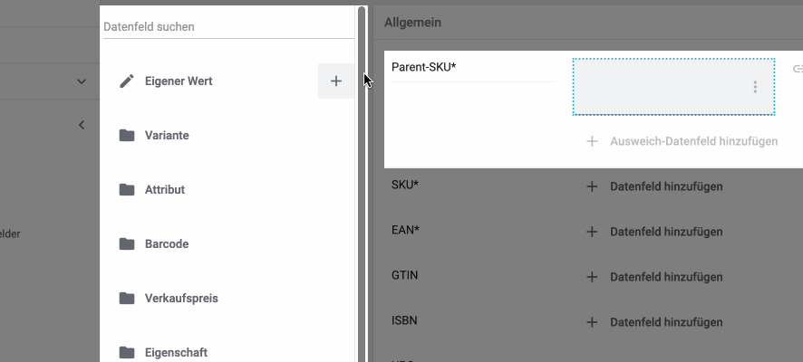

= Spielwiese
:lang: de
include::{includedir}/_header.adoc[]
:author: team-multi-channel
:keywords: spielwiese
:description: Testseite für Formatierungen
:position: 0
:url: maerkte/spielwiese
:id: IAGOJV9

Diese Seite ist nicht Teil des Handbuchs. Aber falls du trotzdem auf dieser Seite gelandet bist: Hallo und herzlich willkommen. Diese Seite ist nur eine Testseite, auf der wir Handbuch-Formatierungen ausprobieren - damit unser Handbuch immer besser wird.

== Ab hier geht es los!

Das Code-Beispiel findest du link:https://raw.githubusercontent.com/plentymarkets/manual/master/de/maerkte/ebay/assets/Main.html[unter diesem Link^]{nbsp}icon:external-link[].

[.collapseBox]
.Beispiel-Code für das Tab *HTML-Struktur*
--
Beispiel-Code für eine mögliche HTML-Struktur:

[source,plenty]
----
<!DOCTYPE html>
<html>
<head>
    <meta charset="UTF-8">
    <title>$ListingTitle</title>
    
</head>
<body>
    $MainFrame
</body>
</html>
----
--

