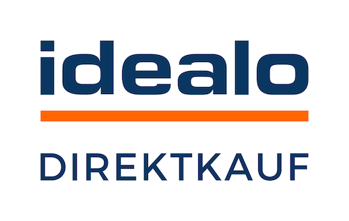

= Markets and price search engines
:lang: en
include::{includedir}/_header.adoc[]
:keywords: market, market, markets, markets, marketplace, marketplace, marketplaces, marketplaces, Multi-Channel, Multichannel, price search engine, price search engines
:description: Multi-Channel in plentymarkets: Setting up interfaces to all available sales channels, such as markets and price comparison portals.
:position: 110
:url: markets
:id: MFX1Q1C
:nav-alias: Overview
:author: team-plenty-channel

On this page you will find every sales channel that has an interface to plentymarkets. All of the settings that need to be carried out for the sales channel are described on one page. Select a sales channel and start setting up the interface.

[TIP]
.Additional marketplaces available as plugins
====
Some marketplaces are available as plugins. The marketplace plugins can be found on the link:https://marketplace.plentymarkets.com/en/plugins/sales/marketplaces[plentyMarketplace^]. +
In addition, further plugins from third-party providers are available in the plentyMarketplace.
====

==  Setting up markets

[.logoList]
//  Market: amazon
* <<markets/amazon/amazon-setup#, >>
//  Market: ebay
* <<markets/ebay/ebay-setup#, image:markets/assets/ebay-logo.png[]>>
//  Market: bol.com
* <<markets/bol-com#, image:markets/assets/bol-com-logo.png[]>>
//  Market: CDiscount
* <<markets/cdiscount#, >>

[.logoList]
//  Market: Check24
* <<markets/check24#, image:markets/assets/check24-logo.png[]>>
//  Market: Conrad
* <<markets/conrad#, image:markets/assets/Conrad_Logo.png[]>>
//  Market: Etsy
* <<markets/etsy#, image:markets/assets/etsy.png[]>>
//  Market: flubit
* <<markets/flubit#, image:markets/assets/flubit-logo.png[]>>

[.logoList]
//  Market: fruugo
* <<markets/fruugo#, image:markets/assets/fruugo-logo.png[]>>
//  Market: Galaxus
* link:https://marketplace.plentymarkets.com/en/plugins/integration/galaxus_4788[]
//  Market: hood
* <<markets/hood#, image:markets/assets/hood-logo.png[]>>
//  Market: idealo Direktkauf
* <<markets/idealo-checkout/idealo-setup#, >>

[.logoList]
//  Market: Kaufland.de
* <<markets/kaufland-de/kaufland-setup#, image:markets/assets/kaufland_logo_en.png[]>>
//  Market: kauflux
* <<markets/kauflux#, image:markets/assets/kauflux-logo.png[]>>
//  Markt: mercateo
* <<markets/mercateo#, image:markets/assets/mercateo-logo.png[]>>
//  Markt: metro
* link:https://marketplace.plentymarkets.com/en/metro_6600[image:markets/assets/metro.png[]]

[.logoList]
//  Market: neckermann
* <<markets/neckermann/neckermann-at-setup#, image:markets/assets/NeckermannLogo.jpg[]>>
//  Market: Netto
* <<markets/plus-gartenxxl#, image:markets/assets/netto.png[]>>
//  Market: otto
* <<markets/otto/otto-market#, image:markets/assets/otto-market-logo.png[]>>
//  Market: ricardo
* <<markets/ricardo-ch#, image:markets/assets/ricardo-RGB.png[]>>

[.logoList]
//  Market: Shopgate
* <<markets/shopgate#, image:markets/assets/shopgate-logo.png[]>>
//  Market: wish.com
* link:https://marketplace.plentymarkets.com/en/plugins/channels/marktplaetze/wish_5866[]
//  Market: Voelkner
* <<markets/voelkner#, image:markets/assets/voelker-logo.jpg[]>>
//  Market: yatego
* <<markets/yatego#, >>

[.logoList]
//  Market: zalando
* <<markets/zalando#, image:markets/assets/zalando-logo.png[]>>

== Using price search engines

Many price search engines are available in the link:https://marketplace.plentymarkets.com/en/plugins/sales/price-comparisons[plentyMarketplace^]. In order to use a price search engine, install the plugin in plentymarkets.

* <<markets/price-search-engines/awin#, Awin>>
* <<markets/price-search-engines/beezup#, BeezUp>>
* <<markets/price-search-engines/belboon#, belboon.com>>
* <<markets/price-search-engines/billiger-de#, billiger.de>>
* <<markets/check24#, Check24>>
* <<markets/price-search-engines/criteo#, Criteo>>
* <<markets/price-search-engines/econda#, econda>>
* <<markets/price-search-engines/geizhals-de#, Geizhals.de>>
* <<markets/price-search-engines/google-shopping#, GoogleShopping>>
* <<markets/price-search-engines/guenstiger-de#, guenstiger.de>>
* <<markets/idealo-checkout/idealo-setup#, idealo>>
* <<markets/price-search-engines/kelkoo#, kelkoo>>
* <<markets/price-search-engines/kupona#, KUPONA>>
* <<markets/price-search-engines/mybestbrands#, My Best Brands>>
* <<markets/price-search-engines/shopping-com#, shopping.com>>
* <<markets/price-search-engines/shopping24#, shopping24.de>>
* <<markets/price-search-engines/shopzilla#, shopzilla.de>>
* <<markets/price-search-engines/tracdelight#, tracdelight>>
* <<markets/price-search-engines/treepodia#, treepodia>>
* <<markets/price-search-engines/twenga#, Twenga>>

… and many more!

//  Markt: limango
// * <<maerkte/limango#, image:markets/assets/limango_logo.png[]>>
