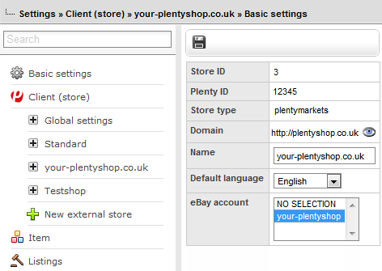

= Online store
:lang: en
include::{includedir}/_header.adoc[]
:author: team-webshop
:keywords: Online store, Client (store)
:position: 100
:url: online-store
:id: MRYCME4

*Setup » Client*

== General information about clients

The *Client (store)* menu allows you to manage and link several online stores to one back office/administrative system. This means that you can set up several further stores beside your standard online store. Up to 30 independent online stores (clients) can be managed with one plentymarkets system. These online stores are closed and independent systems. Their data is separated from the data of other stores. Consequently, it is possible to handle several different areas of business with one plentymarkets system. You will find an example with the possibilities of linking several online stores in chapter 4 of this page of the manual.

[TIP]
.Tip: The plentymarkets online store
====
plentymarkets contains a fully integrated online store function (B2B &amp; B2C). Each store is accessible via an individual domain. With the help of the integrated CMS (content management system), it is possible to carry out changes and extensions with regard to content and graphics. Individual store templates can be directly imported in a complete online store design format with pre-configured settings. This can be done in the *<<omni-channel/online-store/setting-up-clients/cms#, CMS>>* menu. It is also possible to hire an external agency or one of our certified service providers to create the online store design for you (fee-based service).
====

In practice, it is useful to set up one or more additional stores if you want to offer very distinctive product portfolios on different domains. This way, you can manage orders and items in one central system. You can individually define the design and items that are to be displayed in each store.

One central system is used for processing orders. This includes the printing of invoices as well as an email service. It is possible to use different <<orders/order-documents#1800, number ranges>> for each client (store) and each country of delivery.

If two stores of one system are linked together with a banner, then the shopping cart will remain as it is when switching from one store to the other. For further information, refer to section 4 on this page of the manual.

[NOTE]
.Order clients (stores)
====
Go to *Start » Service Center » Tab: Contract* and click on *System configurator* to order additional clients (stores).
====

[IMPORTANT]
.Save your data before you cancel a client (store)
====
Save any client-specific data you may need in the future before your client (store) is deleted. +
Client-specific data you will need later, e.g. scheduler or orders, by assigning them to a different client. +
Save revenue by carrying out a revenue export. You can save other data using the dynamic export function.
====

== Setting up a client

After the client (store) has been activated, go to *Setup » Client* and carry out the settings within the menu of the client in question. The setting options here are mainly the same as those for standard online stores. Therefore, refer to the *<<omni-channel/online-store/setting-up-clients#, Setup » Client » Select client>>* pages of the manual.

[IMPORTANT]
.Name of the menu
====
The menu of a client is given the name of the store. You find the main menu of a client in the *Setup » Client* menu, below the *Standard* menu (= your standard online store's menu). The menus of further clients (stores) will also be organized here (image 1).
====

__Image 1: Clients (stores); overview__

The following table contains information about the settings that differ from those settings for standard online stores.

.differing settings for clients (stores)
[cols="1,3"]
|====
|Setting |Explanation

2+^| *<<omni-channel/online-store/setting-up-clients#basic-settings, Basic settings>> menu*

| *Store ID*
|Store ID of a client. The ID is unique and can not be changed. You can use the store ID to tell clients apart from each other. Your standard online store has the ID *0*. Consecutive IDs starting with ID 1 are allocated to clients (stores).

| *Domain*
|The client's (store) <<business-decisions/system-administration/domains#, domain>>. A domain is an Internet address in the form of a name and an extension, i.e. the Top Level Domain. The name and extension are separated from each other with a period. +
If a <<business-decisions/system-administration/domains#, SSL certificate>> was set up, the client (store)'s URL will be displayed with *https* instead of *http*. +
*__Tip:__*: Click on the *preview icon* to display the client (store).

| *Default language*
|Select the language for the client (store).

| *eBay account*
|Displays the eBay accounts that were saved in the *<<omni-channel/multi-channel/ebay#65, Setup » Markets » eBay » Accounts>>* menu. Select which eBay account should be used for the client (multiple selection using *Ctrl + mouse click*).

2+^| *<<omni-channel/online-store/setting-up-clients/online-store#content-pages, Online store » Pages>> menu*

| *Bank details page*
|Select which page includes the *<<payment/managing-bank-details#, bank details>>*. This page appears as part of the order status page of the online store. +
*__Important__*: If you use this setting you also need to go to *<<payment/managing-payment-methods#, Setup » Orders » Payment » Payment methods>>* and select the option *Show bank details* (place check mark) in the payment methods *Invoice* and *Cash in advance*.

2+^| *<<omni-channel/online-store/setting-up-clients/order-process#, Order process » Basic settings>> menu*

| *Use standard country of delivery as company location*
|Choose *Yes* if you want the tax-related settings in the system, e.g. the VAT, to match the standard country of delivery that was selected. +
__*Important:*__VAT rates have to be saved for the standard country of delivery. This is done in the *<<orders/aaccounting#, Setup » Client » Select client » Locations » Select location » Accounting>>* menu. +
*__Example:__* A seller has a company that is located in Germany. However, they have many French customers and set up a client (store) specifically for them. The seller selects *France* as the *Standard country of delivery*. If the seller chooses *Yes* for the option *Use standard country of delivery as company location*, then France will be treated as if it were the *system country*. All of the processes that are associated with it will be carried out as if the company were located in France.

2+^| *<<crm/sending-emails#, email>> menu*

| *Email settings*
|If you want to use an email configuration for your client (store) that is different from the one set up for your standard online store, then save your new configurations in the <<crm/sending-emails#, email>> submenu. If you want to use the same account, then you can copy the configuration for your standard online store.
|====

== Distributing items among clients (stores)

You can control which items are offered in which store by linking categories. Only those categories that were activated for the individual client (store) in the *<<item/managing-categories#2, Item » Categories>>* menu will be displayed in the corresponding store.

[.instruction]
Activating categories:

. Go to *Item » Categories*.
. Open the category that you want to activate for one or more clients (stores).
. Mark the clients (stores) that should offer items of this category.
. Select the option *Apply visibility to subcategories* if you want to apply the settings to all of the subcategories.
. *Save* the settings. +
→ The category is displayed in the selected client (store).

[NOTE]
.Setting up the visibility of items
====
Set the availability and store visibility of a variation in the *<<item/managing-items#230, Settings>>* tab of the variation.
====

== Linking several clients with one online store

Categories can also be distributed among several clients (stores) if only one online store is set up. This is recommended if your item category tree has grown tremendously over the years and the store customer is likely to have trouble finding their way around. In order to structure your store and the category tree more clearly, you can use clients (stores) to add another category level.

[NOTE]
.Linking a client with an online store
====
Create clients (stores) for various topics. Activate the categories that should be displayed in each store (chapter 2). Only the categories that were activated in the *<<item/managing-categories#2, Item » Categories>>* menu will be displayed for the corresponding client (store). In addition to the standard category navigation (image 2, purple arrow), a further navigation will be added to the *<<omni-channel/online-store/setting-up-clients/cms#web-design, store design>>* e.g. at the top of the page (image 2, green arrow). The clients will be linked there. The navigation bar leading to the individual clients has to be inserted using the template function **. You have to replace the X by the ID of the store.
====

image::online-store/assets/EN-Settings-Client-02.png[]

__Image 2: additional bar for navigation in the online store (green arrow)__

[TIP]
.Example
====
Image 2 shows an example for an online store (sweatrelief.info) which is linked to a client (organicum.de). The client (store) organicum.de is linked in the navigation bar. Assuming this client (store) has the ID 2 in the plentymarkets backend, then the link to organicum.de would be: *&lt;a href=""&gt;organicum.de&lt;/a&gt;*.
====
